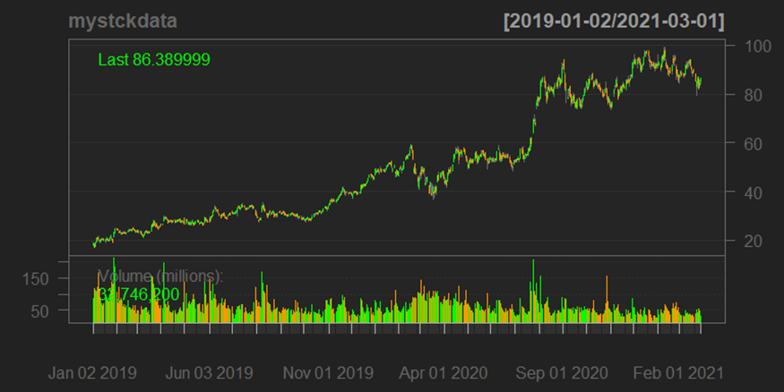
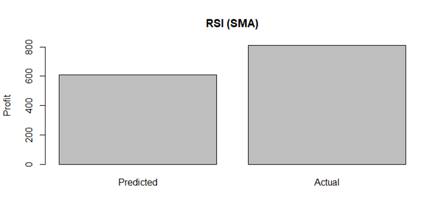
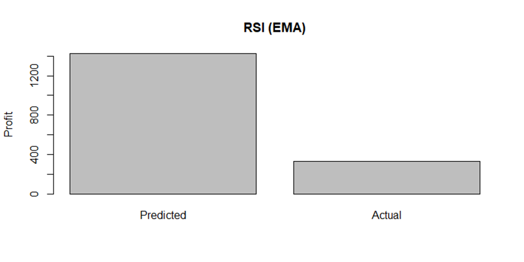
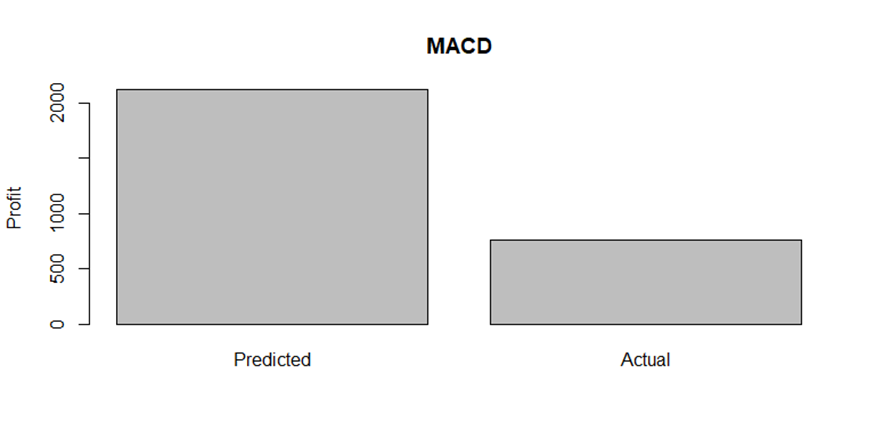
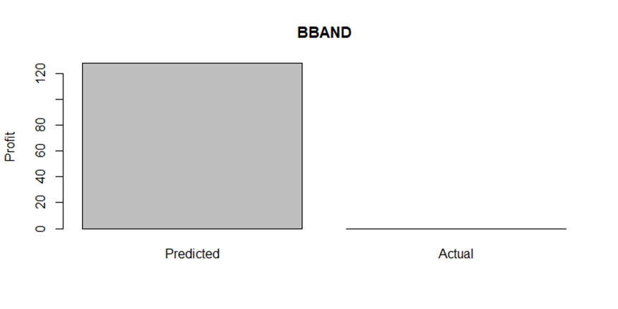
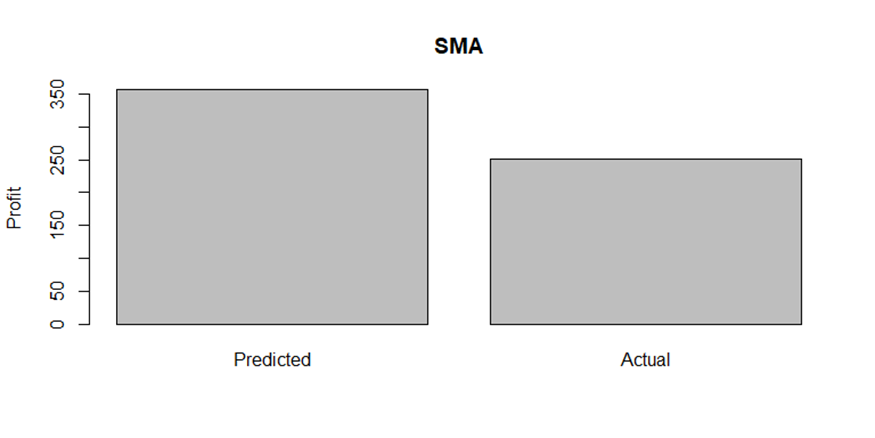
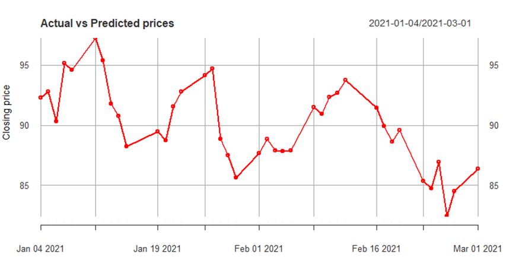
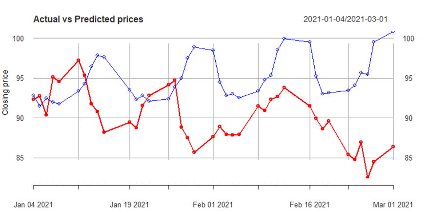

##Introduction to Algorithmic Trading Strategy

In recent years, many researchers have tried to come up with algorithms to earn profits from stock trading and foreign exchange. This objective has turned out to be a rather difficult challenge. There are many sophisticated strategies available to study which can be used to generate some profit by trading in stocks. But the volatility of the stock prices over time has made it difficult to have an assured estimate of returns from these trades. One common approach to this problem has been Machine learning for the past many years. The aim is to learn the trend and train the model on the stock’s past data, thereby being able to predict future prices. This has not been achieved as accurately as expected. Many recent works have employed Genetic Algorithms to help achieve the above-mentioned objective. F Allen et all in their work (Using genetic algorithms to find technical trading rules) used Genetic Programming to come up with optimized trading strategies. Here their objective was to come up with trading rules that can identify periods to be in the index when daily returns are positive, and volatility is low and out when the reverse is true. The limitation of their work was that their work could only be justified by low-order serial correlation in stock index returns. Akinori Hirabayashi et all in their work (Optimization of the Trading Rule in Foreign Exchange using Genetic Algorithm) had a similar approach for forex trade. They used Genetic Algorithm to automatically generate trading rules based on Technical Indexes. Their work focused on calculating the most appropriate trade timing, instead of predicting the trading prices. Taking inspiration from these recent works, we have come up with an approach to forecast prices for a certain trading window. We achieve this with the use of Genetic Programming. Now the forecasted prices are not considered to be accurate because of all the factors involved in the market that affect the stock price, we aim to understand the trend of the stock price in question. We generate technical indicator signals such as RSI, MACD, and SMA based on the forecasted prices. We then formulate our trading rules based on these signals and compare the profits earned while applying trading rules based on the signals from each of these indicators.

##Stocks chosen

We have chosen stock data of AMD (Advanced Micro Devices) for our analysis. This is primarily because of the low volatility and general uptrend in the stock’s performance between 2019 and 2021. During our first assignment, when we tried to pick the best-performing assets among NASDAQ 100 stocks using Genetic Algorithm, AMD consistently featured in the best-performing asset list. Based on this experience, we analyzed the behavior of this stock further and after empirical analysis and experimenting with various other stocks, we have concluded that AMD is best suited for our trading strategy.



##Details of trading strategy

Our trading strategy is to first forecast data for the next 60 days, we will refer to this period as the prediction window in this report. Next, we used trading indicators such as SMA, RSI, Bollinger Bands, and MACD to generate trading signals for the trading days during the prediction window. And finally, we executed trades ( buy & sell) based on the trading signals and calculated the cumulative profit based on the number of shares bought and sold using a trading budget of $10,000. We have used the gramEvol function in R to forecast future data for implementing a genetic programming model. The lag data from the past 10 days was used in the grammar expression along with other functions such as sin, cos, tan, sqrt, min, max, exp, and log. The block to create grammar is as shown below

```bash
rules <- list(expr = grule(op(expr, expr), func(expr), var,rd),
              func = grule(sin, cos, exp, log, sqrt,min,max,tan),
              op = grule('+', '-', '*', '/', '^'),
              var = grule(pricedata$x10, pricedata$x9, pricedata$x8, pricedata$x7,                             pricedata$x6, pricedata$x5, pricedata$x4, pricedata$x3,
                          pricedata$x2, pricedata$x1),
              rd = gvrule(seq(-10,10,0.2))
)
ruleGrammar <- CreateGrammar(rules)
```

The fitness function used for this program makes use of RMSE as fitness to drive the genetic programming model towards an expression that has the least RMSE with respect to the target value which is the actual column used to generate lag. During our testing we observed that in some cases, the best expression obtained from the model would be one of the lag data columns used while creating the grammar rule. To overcome this problem, we have penalized such expressions in the fitness function as shown in the code block below:

```bash
rmseFitnessFunc <- function(expr) {
  result <- eval(expr)
  if (any(is.nan(result)) || any(is.na(result)) || (expr=="pricedata$x1")
      || (expr=="pricedata$x2"))
    return(Inf)
  return (sqrt(mean((pricedata$x - result)^2)))
}
```

For running the Genetic programming , the default parameters have been modified based on emperical testing to achieve the best results. The optimizer is set to “ga” and the number of iterations has been modified from a default value of 250 to 500. A maximum tree depth of 5 is chosen. And the termination cost is set to 1. The GP function with new parameters is as shown below:

```bash
ge <- GrammaticalEvolution(ruleGrammar, rmseFitnessFunc,
                           terminationCost = 1, max.depth = 5,
                           optimizer = "ga",
                           iterations=500)
```

We have initially trained the model on a training data which constitutes 80% of all the data from 1-1-2019 to 1-1-2021. Once training is done, we have evaludated the performance on test data which is the remaining 20% data during the same period. The last row of test data is used as input to forecast data for next day using the best expression generated by the model, subsequently each day’s forecasted data is combined with previous 9 days data to forecast data for the next day. By doing this we forecast data for all the trading days with in the prediction window. The function used for forecasting is as shown below:

```bash
pricedata <- pricedata[nrow(pricedata),]
future_date <- c()

##predict prices during trading days among next 60 days
for(i in 1:nrow(forecast_data_actual)){
  future_date[i] <- eval(ge$best$expressions)
  for (j in (windowSize:2)){
    pricedata[j]<-pricedata[j-1]
  }
  pricedata[1] <- future_date[i]
}
```

##Performance of the model

After running GP for forecasting Open Price and closing price within the prediction window, we obtain the best expression as shown in the output window below:

```bash
##
##  Executing GP for Close Price
## Grammatical Evolution Search Results:
##   No. Generations:  500
##   Best Expression:  pricedata$x1 + pricedata$x2/exp(3.8)/(exp(sin(pricedata$x5)) * 5.6)
##   Best Cost:        1.60273190074338
##
##  Executing GP for Open Price
## Grammatical Evolution Search Results:
##   No. Generations:  500
##   Best Expression:  pricedata$x1/cos(tan(-6.2))
##   Best Cost:        1.54318447790166
```

We then forecast the data for the trading days in the prediction window and order them by the actual trading days. Once we have the forecasted data, we have tried to generate trading signals using different trading indicators. The parameters used to generate trading signals are obtained after research done reading through blogs such as https://bookdown.org/kochiuyu/technical-analysis-with-r-second-edition2/macd.html and also through experimentation with different set of values for each of the parameters. For SMA we used the standard low and high values as 20 and 40 respectively. For RSI we have used low and high values of 40 and 60 respectively and used two different input parameters as SMA and EMA. For Bollinger band we used the number of days as 20 and the standard deviation as 2. And finally for MACD we have used popular values of 12 and 26 for fast moving and slow moving lines respectively.
Once the trading signals are generated we execute the trade and calculate the profits. The trading signal 1 is an indication to buy, whereas -1 is an indication to sell and finally 0 stands for hold. To calculate profit, we first calculate how many shares are bought during the buy trade using the trading budget of $10000. Then this value is multiplied with the difference between selling price and buying price. The sum of profits for each individual trade is considered as the overall profit. The function for calculating trade is as shown below:

```bash
doTrading <- function(Forecasted){
  buy <- c()
  sell <- c()
  profit <- c()
  number_of_stocks <- c()
  buyTrades <- 1
  sellTrades <- 1
  tradingBudget <- 10000
  buyOK <- TRUE
for(i in 1:(nrow(Forecasted)-1)){
  if ((Forecasted$signal[i] == 1) & buyOK){

    buy[buyTrades] <- Forecasted$Open[i+1]
    number_of_stocks[buyTrades] <- tradingBudget %/% Forecasted$Open[i+1]
    buyTrades <- buyTrades + 1
    buyOK <- FALSE
     }
  else if ((Forecasted$signal[i] == -1) & !buyOK){
    sell [sellTrades] <- Forecasted$Open[i+1]
    profit[sellTrades] <- number_of_stocks[sellTrades] * (sell[sellTrades]-buy[sellTrades])
    sellTrades <- sellTrades + 1
    buyOK <- TRUE}
  if (i == (nrow(Forecasted)-1)){
    if (!buyOK){
      sell [sellTrades] <- Forecasted$Open[i]
      profit[sellTrades] <- number_of_stocks[sellTrades] * (sell[sellTrades]-buy[sellTrades])
    }
    #cat("Buy",buy)
    #cat("\nSell",sell)
    #cat("\nprofit",profit)
    final_profit <- sum(profit)
  }
}

  return (final_profit)
}
```

The results from the profits obtained using each of the training indicators is as shown below:

```bash
##
## Profit obtained with RSI(SMA) on forecasted data : 607.9914
##
## Profit obtained with RSI(EMA) on forecasted data: 1424.705
##
## Profit obtained with MACD on forecasted data 2122.923
##
## Profit obtained with BBAND on forecasted data 128.0265
##
## Profit obtained with SMA on forecasted data 356.9182
```

##Backtesting

```bash
##
## Profit obtained with RSI(SMA) on actual data: 810.0107
##
## Profit obtained with RSI(EMA) on actual data: 333.1505
##
## Profit obtained with MACD on actual data 755.32
##
## Profit obtained with BBAND on actual data 0
##
## Profit obtained with SMA on actual data 250.56
```

Comparison of performances using graph between forecasted data and actual data are shown below:














